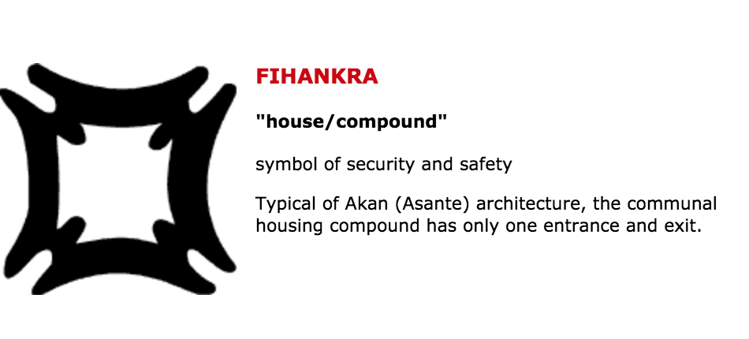
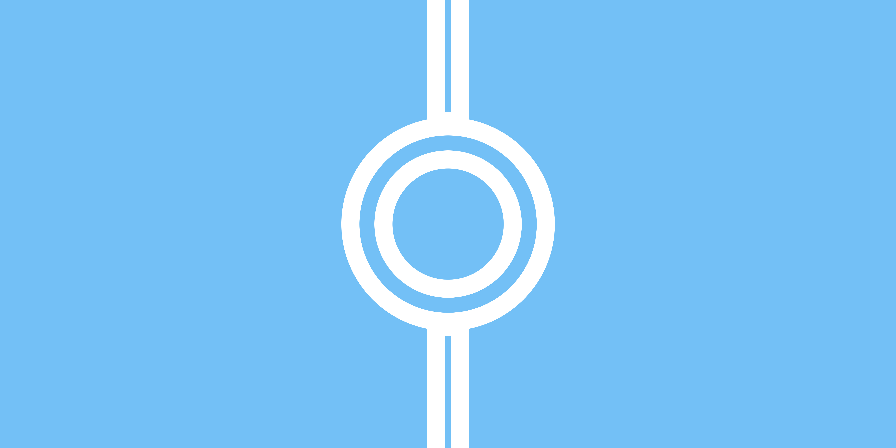
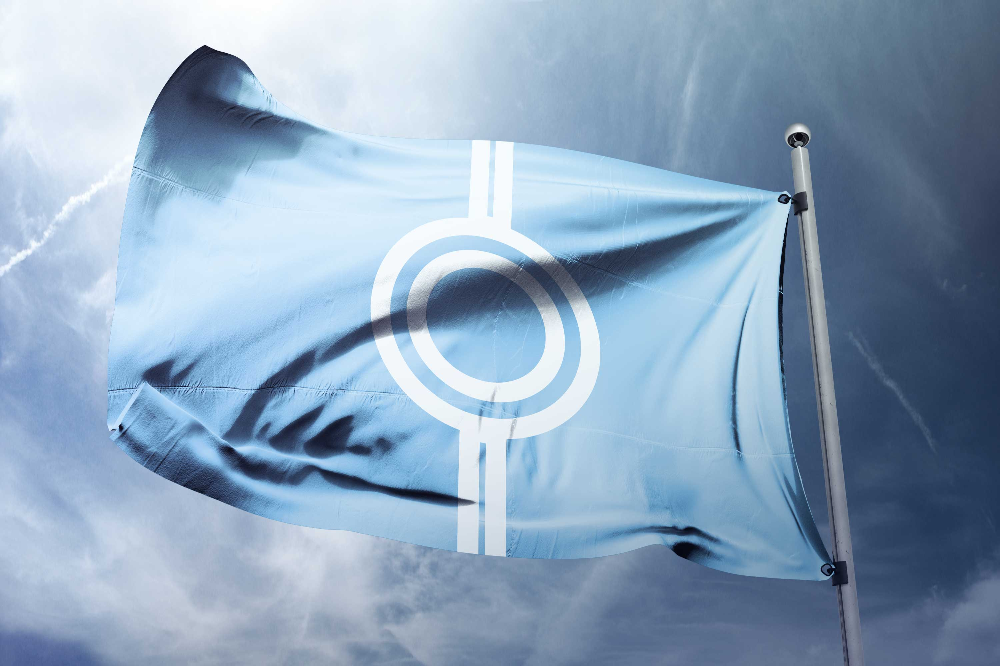

# Union Hack :gb:

## Callum

#### My first flag I decided to look at the North Korea flag as they are having some issues over there at the moment and wanted to see if I could reflect the kind of society they have within there flag. Below is a screenshot of a symbol I found which means Safety And Secruity

I feel like with the leader they have he keeps the country safe and guarded from outside world. Because of the way the country is lead I changed the flag from one symbol and replaced it with this symbol.

My next design I had inspiration of how tight the border is into North Korea and still kept the flag simple but managed to create something that represents the high secruity. This is an image of the border;

And below is the flag I designed

My next flag took inspiration from how uniform and strict the leader and the law enforcment officers are. Below is a picture of the Leader or NK and some secruity officers.

And below is the flag

This is my 4th flag and it is one that I am proud of. North Korea would never use a flag like this at is it rather controversial. It shows that North Korea is seperated from the world and enclosed and no one gets out or in without permission. They dont have much connection to the world and it shows the symbol of the star between essentially two walls.

## My Own Flag

This is the flag I designed for my own country where designers live. I chose the light blue colour as it is easy on the eye and evokes a happy emotion which is what I want to show. In terms of the shapes and design I wanted to show that no matter who you are where and wherever you are going everyone will get along as everyone is designers. The top and bottom of the flag represent roads and the middle represents a community circle where everyone gets along.

### Below is a mockup of what the flag would look like

