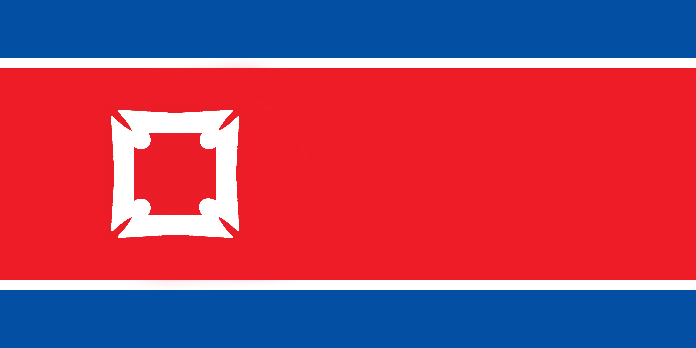

# Union Hack :gb:

* What existing flags have you mashed up? Let's see.
* What (real or imaginary) places could you design flag(s) for? Let's see your sketches.
* How are you going to present your ideas, creative process and experiments next week (formative presentations)?
* What's your team GitHub repository? You may want to create an organisation (a GitHub group) for that..

### MAKE YOUR OWN FLAG

Keep it simple. The flag should be so simple that a child can draw it from memory.
Use meaningful symbolism. The flag’s images, colours, or patterns should relate to what it symbolises.
Use 2 or 3 basic colours. Limit the number of colours on the flag to three which contrast well and come from the standard colour set.
No lettering or seals. Never use writing on any kind or an organisation’s seal.
Be distinctive or be related. Avoid duplicating other flags, but use similarities to show connections.

## Payman

I choose the flag of Canada. I have added a few silhouette images of some of the things that Canada is famous for which include ice hockey, moose, totem pole, bear and a mountain which is called the Canadaian rockies. By adding the mountains it has slighty changed the colour of the flag with parts being darker red. 

![alt test] (Photos/Canada flag.jpg)

## Callum

#### My first flag I decided to look at the North Korea flag as they are having some issues over there at the moment and wanted to see if I could reflect the kind of society they have within there flag. Below is a screenshot of a symbol I found which means Safety And Secruity

#### I feel like with the leader they have he keeps the country safe and guarded from outside world. Because of the way the country is lead I changed the flag from one symbol and replaced it with this symbol.

#### My next design I had inspiration of how tight the border is into North Korea and still kept the flag simple but managed to create something that represents the high secruity. This is an image of the border;

#### And below is the flag I designed

#### My next flag took inspiration from how uniform and strict the leader and the law enforcment officers are. Below is a picture of the Leader or NK and some secruity officers.

#### And below is the flag

#### This is my 4th flag and it is one that I am proud of. North Korea would never use a flag like this at is it rather controversial.

